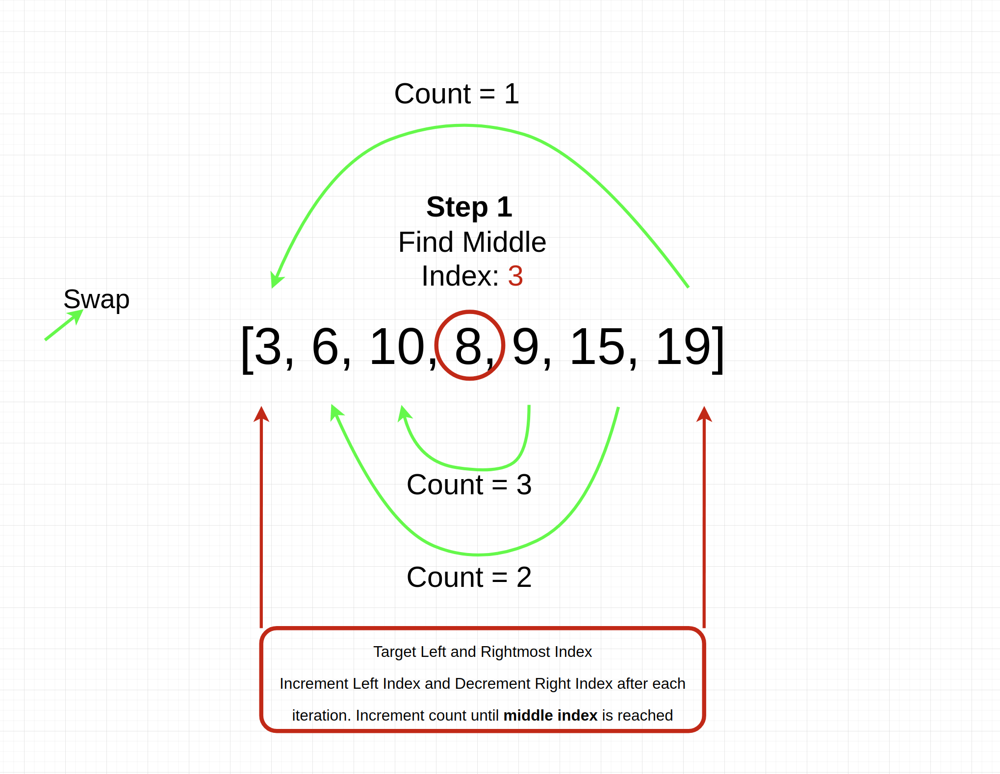

# Reverse an Array

Write a function called reverseArray which takes an array as an argument. Without utilizing any of the built-in methods available to your language, return an array with elements in reversed order.

## Challenge 
On your branch, create a file called ArrayReverse.java
Include any language-specific configuration files required for this challenge to become an individual component, module, library, etc.
NOTE: You can find an example of this configuration for your course in your class lecture repository.

## Approach & Efficiency

Target the middle, first, and last index then assign a counter variable. While the counter is less than the middle index  swap the variable at the left index with the variable wih the right index.

